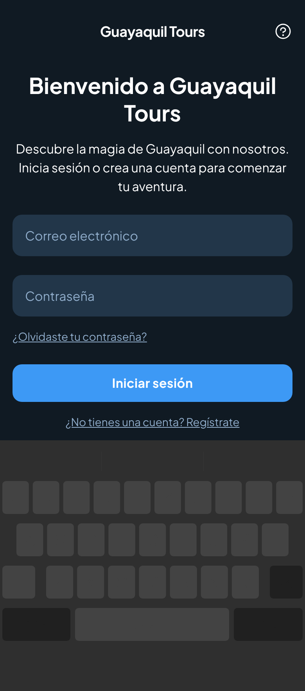
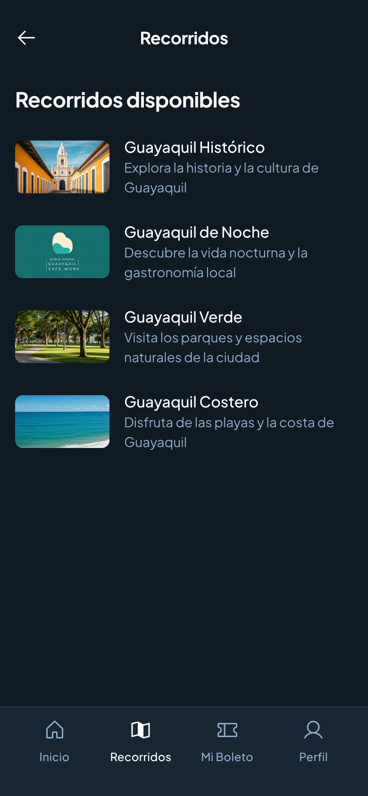
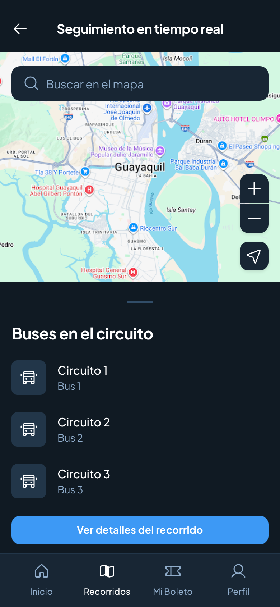
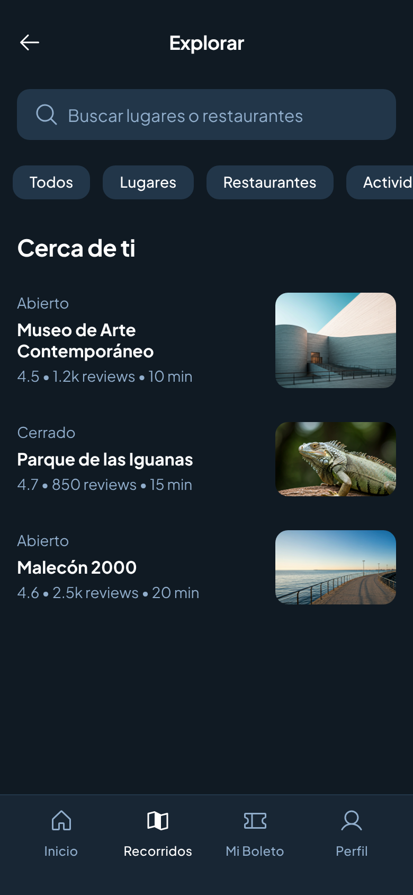
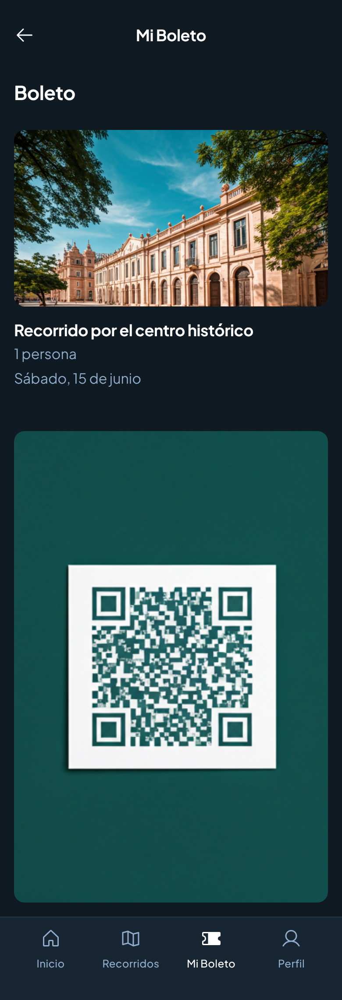
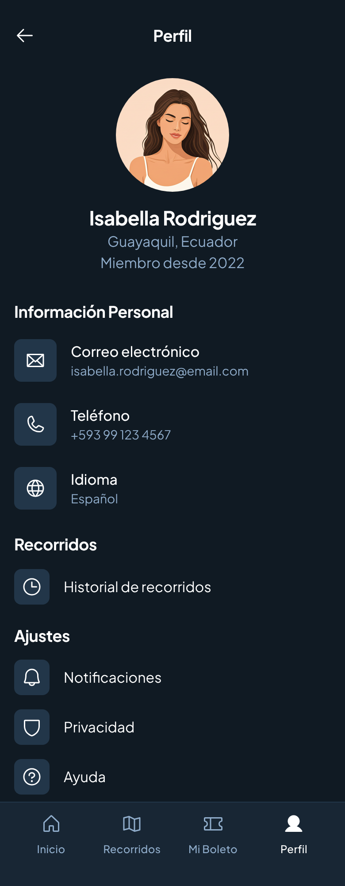
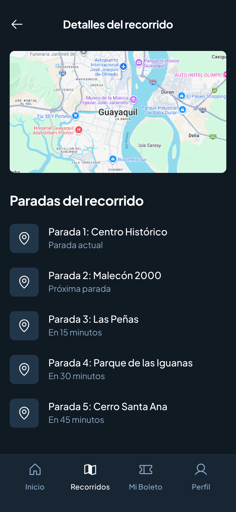

# demoTransporte

# 🚍 App de Turismo - Guayaquil

Aplicación móvil para una agencia de turismo que permite:  
- Registro e inicio de sesión.  
- Selección de recorridos turísticos.  
- Seguimiento en tiempo real de los buses 1, 2 y 3.  
- Visualización de sitios de interés y restaurantes por paradas.  
- Generación de un código QR como boleto de acceso.  

---

## 📸 Capturas de Pantalla

### 📝 Pantalla de Login

  

### 🚌 Recorridos Disponibles

  

### 📍 Seguimiento en Tiempo Real

  

### 🏛️ Lugares por Parada

  

### 🎟️ Mi Boleto

  

### 👤 Mi Perfil

  

### 📍 Lista de Paradas por Recorrido

  

---
